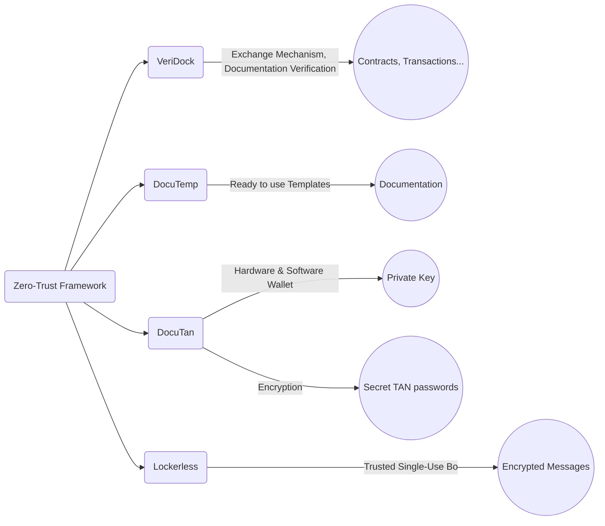

# [Unleaky - Trusted Foundation](http://www.unleaky.com)

A trusted foundation means a reliable and solid foundation of organization, system, policy, in which you have full confidence. 
It can be a reliable foundation on which a project, idea, relationship or business is established or built. 
Reliability can come from trustworthiness, transparency, performance history, ...

+ we offer the “Trusted Foundation” for your organization and team
+ we are implementing a "zero trust framework" to ensure a trusted network and infrastructure
+ we support your team in wide range of DevOps and NetOps services

### Our "zero-trust framework"

+ [VeriDock](http://www.veridock.com) - Exchange mechanism, documentation verification algorithm for contracts, transactions, ...
+ [DocuTemp](http://www.DocuTemp.com) - ready to use in templates for documentation
+ [DocuTan](http://www.DocuTan.com) - Private key hardware & software wallet with encryption and secret TAN passwords
+ [Lockerless](http://www.Lockerless.com) - trusted single-use box for encrypted messages

Example of diagram for the processes in "zero-trust framework" includes and is linked to VeriDock, DocuTempl, DocuTan, and Lockerless, with an explanation of what each of these components does:

## Vision: 
+ To establish Unleaky as a synonym for trust and security in the digital world, transforming businesses into leak-proof entities and fostering a safer and more secure digital ecosystem globally.

## Strategy: 

+ **Innovation Excellence**: Continuously develop and upgrade our cybersecurity solutions to stay ahead of evolving threats. 
+ **Customized Solutions**: Offer adaptable, tailored data protection services to cater to the unique requirements of each business. 
+ **Partnership Approach**: Establish relationships with businesses to better understand their unique security needs and deliver personalized service.
+ **Educative Empowerment**: Provide resources, knowledge, and tools that enhance businesses' understanding and management of digital security risks.
+ **Customer Relationship**: Ensure strong customer bonds through transparency, swift assistance, and consistent support.

## Values: 

### Integrity
Uphold transparency and honesty in all our dealings, fostering an environment of trust.

### Excellence
Strive for superiority in delivering top-tier protection for our clients through our solutions.

### Adaptability
Stay resilient and nimble to efficiently tackle new challenges in the dynamic digital environment.

### Collaboration
Foster a strong sense of partnership within our team and with our clients, promoting collective success.

### Innovation
Encourage innovative thinking to stay a step ahead in the ever-evolving landscape of digital security.

### Respect
Respect our clients' privacy and make their security our prime objective.

### Customer-First Mindset
Place our customers' satisfaction and security at the center of our every action and decision.

# Offer

## FinOfficer SaaS 

[FinOfficer - Encrypted Finances](https://www.finofficer.com/) is an example of usage the zero-trust framework as SaaS

FinOfficer refers to a financial officer in an organization, such as a chief financial officer (CFO) or financial manager. FinOfficer Saas platform is responsible for financial operations such as financial planning, reporting, analysis. We provide an encrypted secure layer for exchanging transactions, data, contracts, documents, invoices.

## Subscription

### Trusted Foundation User Subscription

Our goal is to ensure a reliable foundation for your project or business. With our "zero-trust framework", we offer a secure network and infrastructure for every user in your organization.

- **Per User Subscription Price: $100 monthly**

This subscription includes:

#### VeriDock Access
Exchange mechanism and a documentation verification algorithm for contracts, transactions, etc. 

#### DocuTempl Access
Ready to use templates for documentation.
    
#### DocuTan Access
Private key hardware & software wallet with encryption and secret TAN passwords.

#### Lockerless Access
Trusted single-use box for encrypted messages.

   
- Individual access and support for our wide range DevOps and NetOps services.

This per user subscription model ensures that each member of your team has access to our trusted foundation tools and services under a single, simple price scheme. 

Note: We offer volume discounts for larger teams. Please contact us for more details.

## services

### CDN Services (Content Delivery Network)
- Basic CDN (100GB): PLN 150/month
- Standard CDN (500GB): PLN 500/month
- Premium CDN (over 1TB): PLN 1,000/month

### Encrypted Messaging Services
- Basic (up to 25 users): PLN 100/month
- Standard (up to 100 users): PLN 350/month
- Premium (unlimited users): PLN 700/month

### Backup Services for Infrastructure
- Basic backup (100GB): PLN 200/month
- Standard backup (500GB): PLN 600/month
- Premium backup (over 1TB): PLN 1,200/month

## Partnership

At Unleaky, we don’t believe in transactional relationships. 
We believe in forming long-term partnerships with our customers. 
Our goal is not just to provide immediate solutions but to engage with you on a more profound level to understand your needs and goals completely.

### Cooperation Strategy:

#### Onboarding and Continuous Consultation
We start our engagement by understanding your current operations state, needs, and growth plans. Our team of experts will consult and guide you throughout the service provisioning process and beyond.

#### Customized Solutions
Each company is unique. Understanding this, we offer tailored solutions suitable for the specific requirements of your small business. Our team will work with you to identify the right mix of services that would serve your business best.

#### Scalable Support
As your business grows, so can the support we provide. We'll work along-side you to scale our services as per your growing requirements. Whether it's increased data protection or larger, more complex network operations, we're ready to expand our support.

#### Ongoing Relationship Management
We believe customer relationships aren't just for problem-solving but also for regular check-ins, feedback discussions and improvements. We believe in proactive communication and regular reviews to make sure your needs are continuously met.

#### Educative Empowerment
We empower you with the knowledge and resources to understand and navigate digital security risks better. We run webinars and workshops and provide learning resources.

### Use cases:

#### Outsourcing DevOps
Say a software development company wants to focus more on its core operations and less on managing infrastructure. 
Unleaky can be their partner in managing their DevOps pipeline - right from continuous integration, continuous deployment/delivery (CI/CD) to infrastructure monitoring.

#### Outsourcing NetOps
Consider a small e-commerce business that wants its network operations to run smoothly 24/7 but lacks the expertise in-house. 
Unleaky can manage the network - ensuring secure and robust connections, managing load balancers, firewalls, routers etc., resulting in minimized downtime.

---

We at Unleaky appreciate the trust our customers put in us. 
By entrusting us with your Digital Security, DevOps, and NetOps, you can focus on what you do best: running and expanding your business. 
We'll take care of making sure it's secure and efficient.

---

